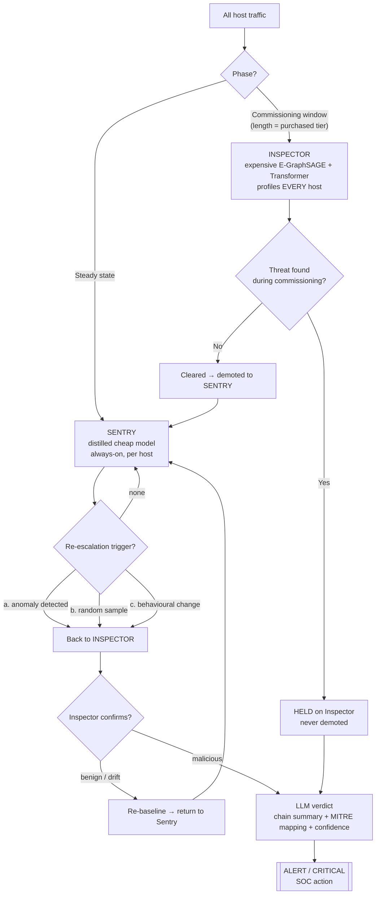

# NetSentinel

**Sequence-aware detection of "Living off Trusted Sites" (LSA / LOTS) attacks, with an expensive-Inspector → distilled-Sentry pipeline that keeps GPU cost low without lowering the ceiling on what can be caught.**

---

## 1. The problem

Modern intrusions increasingly avoid custom malware infrastructure. Instead they **live off trusted sites (LOTS / LSA)** — every hop of the kill chain rides a domain nobody can block:

| Stage | Trusted service used | What it actually is |
|-------|----------------------|---------------------|
| Recon | `ip-api.com`, `ipify.org` | victim fingerprinting |
| Payload | `raw.githubusercontent.com`, `pastebin.com` | second-stage code pull |
| C2 | `api.telegram.org`, Discord, Slack webhooks | command & control beacon |
| Exfil | `drive.google.com`, Dropbox, S3 | data theft (MITRE T1567) |

Each request, seen alone, is indistinguishable from normal business traffic. A domain allow-list is useless — these domains **must** be allowed. Signature and IOC feeds are useless — there is no bad domain to list.

The signal is not *where* a host goes. It is the **cross-service sequence** — the order, timing, and category-transition pattern of who it talks to.

---

## 2. What doesn't exist yet

- **No public chain-level LSA benchmark dataset.** LOTL (living-off-the-land *binaries*) is well studied; LOTS/LSA at the **network-sequence** level has no provenance-labelled corpus.
- **No interactive sequence-based LSA demonstrator.** There are LOTL tools; there is no system that shows the **category-transition kill chain** being detected as it unfolds.
- **No cost-tiered detector that keeps the expensive model's ceiling.** Existing triage/cascade IDS use a cheap gate as a *filter* — anything the gate clears is trusted and never looked at again, which is exactly the blind spot an LSA attacker waits out.

NetSentinel targets all three gaps. Its defensible contributions are:

1. **Cross-service category-transition sequence semantics** (a Service Category Resolver mapping domains → semantic node types, then modelling transitions between them).
2. **A provenance-labelled chain dataset** strategy (emulated kill chains over trusted services).
3. **Distillation quality as the tunable axis** — how cheap can the always-on model get while staying sensitive enough to re-escalate real attacks but not benign drift.

---

## 3. Architecture

### Flowchart



### ASCII fallback

```
                    ┌─────────────── ALL HOST TRAFFIC ───────────────┐
                    │                                                 │
          COMMISSIONING (tiered length)                        STEADY STATE
                    │                                                 │
              ┌───────────┐                                   ┌───────────┐
              │ INSPECTOR │  profiles everyone                │  SENTRY   │  always-on, cheap
              │(expensive)│                                   │(distilled)│  per host
              └─────┬─────┘                                   └─────┬─────┘
                    │                                               │
        threat found here?                             re-escalate on:
          ├─ yes → HELD on Inspector (never demoted)     (a) anomaly
          └─ no  → CLEARED → demoted to Sentry ──────────►(b) random sample
                                                          (c) behavioural change
                                                               │
                                                    back to INSPECTOR to confirm
                                                               │
                                              ┌────────────────┴───────────────┐
                                        benign/drift                       malicious
                                     re-baseline → Sentry            LLM verdict → ALERT
```

### The retention rule (key design choice)

A threat the Inspector catches **during commissioning is HELD** — it stays on the expensive model for its whole life and is **never handed to the Sentry**. Detection in phase one is not a hand-off; the Inspector keeps monitoring it itself. This closes the classic cascade blind spot where anything the cheap layer "clears" is trusted forever.

### Why re-escalation matters

The Sentry never trusts a certification indefinitely. Three independent triggers pull a host back to the Inspector:

- **(a) anomaly** — the Sentry sees an off-path / suspicious category transition.
- **(b) random sample** — unpredictable spot-checks an attacker **cannot time around**. This is the anti-poisoning mechanism.
- **(c) behavioural change** — drift (role change, new SaaS) → re-baseline rather than alert.

Two distinct kinds of drift are handled separately: **behavioural drift** (rolling re-enrollment) and **taxonomy drift** (threat-intel scrapers keeping the Service Category Resolver current).

---

## 4. How detection actually works

- **Service Category Resolver** maps each domain to a semantic node type (Recon, Code_Repo_Paste, Messaging, Cloud_Storage, Browse, Sync, CI_CD…).
- **Pre-path model** — each host has an allow-list of the service categories its *program/role* is expected to reach. A request **off that pre-path** is the primary signal. Once a host deviates and is detected, it typically **isolates onto its single malicious endpoint** (the C2 channel).
- **Edge features** the models score on:
  - **Egress asymmetry** (upload ≫ download → exfil, T1567)
  - **Polling coefficient of variation** (near-zero CoV → machine beaconing, not a human)
  - **Micro-timing / FFT automation score** (periodic signatures of scripted traffic)
- **Models**: E-GraphSAGE (edge-centric inductive GNN) + a masked-autoencoder / Transformer decoder (GraphIDS-style) producing a **reconstruction error**; error crossing threshold across a category-transition sequence is what fires.
- **LLM verdict** turns the confirmed chain into a human-readable summary with MITRE mapping and a confidence score.

---

## 5. Why it's impactful

| Dimension | Impact |
|-----------|--------|
| **Catches what nothing else does** | LSA/LOTS chains that ride only trusted domains — invisible to allow-lists, IOCs, and signatures. |
| **Cost** | The expensive GNN+LLM stack normally has to run on *all* traffic *all* the time. NetSentinel pays that only during commissioning and on re-escalations; steady state runs the cheap distilled Sentry, cutting GPU/VRAM to a fraction (in the demo, ~90%+ savings vs. inspect-all) **without lowering the detection ceiling** — anything can still be pulled back up to the full model. |
| **No poisoning window** | Random-sample re-escalation can't be timed; "any detected flaw returns to the Inspector" means a dormant-then-active attacker is still caught after it wakes up. |
| **Deployable economics** | Commissioning length scales by purchased tier; monitoring scope should scale by **data sensitivity, not pay grade**. |
| **Explainable** | Analysts get a chain narrative + MITRE technique + confidence, not an opaque anomaly score. |

---

## 6. Benefits summary

- **Detects the undetectable class** — living-off-trusted-sites kill chains.
- **Massive GPU/VRAM savings** vs. running the heavy model on everything, with **no loss of ceiling**.
- **Poison-resistant** through unpredictable sampling + always-return-on-flaw.
- **Drift-aware** — separates behavioural drift (re-baseline) from taxonomy drift (scrapers).
- **Honest latency** — the design surfaces the activation → detection gap instead of hiding it.
- **Explainable, SOC-ready** alerts.

---

## 7. Threat model & honest limitations

**Resists:**
- **Poisoning during commissioning** → random sampling + retention rule.
- **Window-wait bypass** (attacker stays dormant until certified) → dormant-then-active hosts are re-escalated on their first post-activation deviation.
- **Drift** → rolling re-enrollment (behaviour) and scrapers (taxonomy).

**Residual risks (kept honest):**
- **The Sentry's sensitivity is the system's ceiling.** If the distilled model can't spot a deviation, nothing re-escalates. This is the open research problem: *how cheap can the Sentry get while staying sensitive enough?*
- **Activation → first-detectable-flaw latency** is real and non-zero.
- **Lower tiers = shorter commissioning = softer targets.**
- **Scope by data sensitivity, not pay grade** — getting this wrong reintroduces blind spots.

### The three tunable knobs

| Knob | Trades off |
|------|-----------|
| **Sampling rate** | poison resistance ↔ cost |
| **Re-enrollment cadence** | drift resistance ↔ cost |
| **Sentry sensitivity** | catch-rate ↔ false-positives / re-escalation frequency |

---

## 8. Prior art it builds on (not over-claiming)

- **Knowledge distillation / teacher–student** models.
- **UEBA** behavioural baselining.
- **Cascade / triage IDS.**

NetSentinel's novelty is the **combination**: cross-service category-transition sequence semantics + a provenance chain dataset + distillation quality as the explicit cost/sensitivity axis, wired with a **retention rule and unpredictable re-escalation** that remove the cascade blind spot.

---

## 9. The interactive demonstrator

The accompanying app visualises the whole flow on a 14-day timeline:

- **Commissioning → steady-state** phases with a tier selector (Basic / Pro / Enterprise).
- A **host ↔ service-category graph** showing each host's faint **pre-path** and highlighting off-path requests in red; a detected host **collapses to a single red beam** into its malicious endpoint.
- A **GPU meter** contrasting inspect-all vs. NetSentinel with cumulative units saved.
- Scenarios: a **dormant-then-active** attacker (caught after activation), a host **compromised during commissioning** (HELD on the inspector), a **sampled** re-escalation that returns clean, and a **behavioural-drift** host that re-baselines.
- An **LLM verdict** panel and a **chain-level event feed** (CLEARED / RE-ESC / HELD / C2 / EXFIL).
