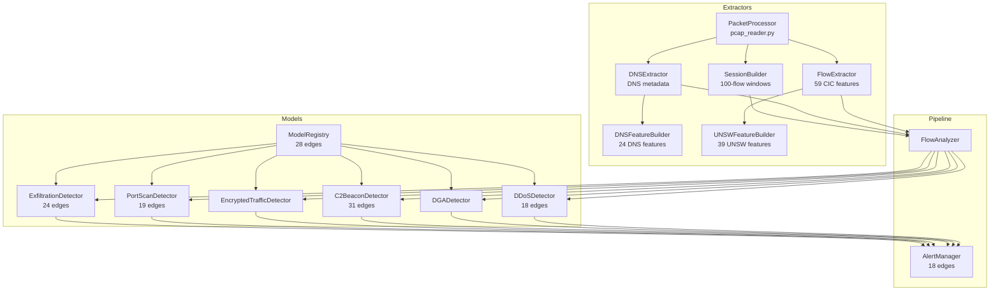

# NetSentinel — Master Context Map

> **Purpose:** Single-file Obsidian-linked knowledge graph of the entire NetSentinel project. Feed this to Claude Opus 5 for full project context.
> **Generated:** 2026-09-04 | **Files scanned:** 65+ source files, 30+ markdown docs
> **Project:** SIH 2026 — AI/ML Network Intrusion Detection System

---

## 🗺️ Navigation — Obsidian Links

### Core Documents
- [[README]] — Main project README (1209 lines, 59KB) — system overview, 6 AI models, pipeline, installation
- [[ARCHITECTURE]] — Deep architecture doc (1098 lines) — mirrors README with more detail
- [[DEMO_GUIDE]] — Demo walkthrough (553 lines) — how to run and present the system
- [[COMPLETE_STATUS_REPORT]] — Final status after real PCAP testing (450 lines)

### Strategy & Critique
- [[CRITIQUE]] — Professional/industrial critique (188 lines) — honest panel-grade assessment of flaws
- [[VALIDATION_AND_STRATEGY]] — Pipeline validation + strategic analysis (987 lines)
- [[NetSentinel_ref]] — V2 Inspector–Sentry architecture reference (187 lines)
- [[cs-bpg-security-method-merged]] — CS-BPG detection method explained (564 lines)

### Implementation
- [[FRONTEND_INTEGRATION_PLAN]] — 26-page frontend design doc (936 lines)
- [[HOW_THE_REAL_PIPELINE_WORKS]] — Pipeline architecture deep-dive (432 lines)
- [[4_day_battle_plan]] — Original 4-day SIH build schedule (368 lines)
- [[BACKEND_REMEDIATION_TODO]] — Backend fixes needed (188 lines)

### Test Results
- [[LIVE_RESULTS]] — Final remediation results with real PCAP (544 lines)
- [[COMPLETE_TESTING_JOURNEY_REPORT]] — Full testing journey (53KB)
- [[HONEST_TEST_REPORT]] — Honest assessment of what works/doesn't
- [[GRAPH_REPORT]] — Code knowledge graph (416 nodes, 656 edges)

### Reference
- [[DOCUMENTATION_INDEX]] — Navigation index for all docs
- [[CICFLOWMETER_INTEGRATION]] — CICFlowMeter feature integration notes
- [[COMPLETE_SETUP_GUIDE]] — Setup instructions
- [[PUSH_CHECKLIST]] — Git push checklist
- [[document_clg]] — College submission document (SIH formal writeup)

---

## 🏛️ Project Identity

**NetSentinel** is an AI-powered Network Intrusion Detection System (NIDS) for **passive monitoring of unidirectional IP traffic** in data diode–protected critical infrastructure.

**Event:** Smart India Hackathon (SIH) 2026 — College Internal Round → Grand Finale
**Team:** 2 people + AI assistance
**Status:** Demo-ready prototype, 6/6 models operational

### Two-Tier Architecture
1. **Tier 1 (Built):** Multi-expert ensemble of 6 specialized ML models for known threat classes
2. **Tier 2 (Designed, Not Built):** [[NetSentinel_ref|Inspector–Sentry cascade]] for [[cs-bpg-security-method-merged|LOTS/LSA detection]] — the genuinely novel contribution

### Core Design Principles
- **No deep packet inspection** — operates entirely on flow metadata → privacy-preserving
- **No signature/rule databases** — zero-day capable, behavior-driven
- **CPU-only inference** — ONNX Runtime, designed for commodity hardware
- **Passive sensor** — detection only, no block/quarantine/mitigation

---

## 🧠 AI Models (6 Experts)

### [[Model A — DDoS Detector]]
- **Architecture:** XGBoost (3000 estimators) → ONNX
- **Training Data:** CIC-DDoS2019 (2.5M flows, 59 CIC-IDS features)
- **Performance:** 99.3% F1 | 99.8% precision | 98.7% recall | <0.2% FPR
- **Input:** 59-dim feature vector (flow-level statistics)
- **Output:** Binary (`DDoS` vs `Benign`) + confidence
- **File:** `ddos_binary_xgboost.onnx` (14MB)
- **Latency:** 4.3ms/flow | 230 flows/sec
- **Source:** [[netsentinel/models/ddos.py]]
- **Feature builder:** [[netsentinel/extractor/flow_extractor.py]] (59 CIC features)

### [[Model B — DGA Detector]]
- **Architecture:** 1D-CNN (2 conv) → BiLSTM (2 layers, 128 hidden) → Dense (3 classes)
- **Training Data:** UMUDGA (1.2M malicious domains, 68 families) + Tranco Top 1M + 50K synthetic DNS tunnels
- **Performance:** 93.6% accuracy (3-class: Benign/DGA/DNS-Tunnel)
- **Input:** Domain name string → 128-char encoding (vocab=38) + 7 statistical features (entropy, bigram score, consonant ratio, etc.)
- **Output:** 3-class probabilities
- **File:** `dga_cnn_bilstm_v2.onnx` (2.8MB)
- **Latency:** 8.1ms
- **Source:** [[netsentinel/models/dga.py]]
- **Key feature:** Bigram transition probability from Qi et al. 2013

### [[Model C — C2 Beacon Detector]]
- **Architecture:** Dual-branch — BiLSTM (sequence) + FFT (periodicity) → Fusion → Dense
- **Training Data:** CTU-13 (13 botnet scenarios, ~200MB CSV)
- **Performance:** 93.5% accuracy | 90.1% precision | 96.2% recall | 8.4% FPR
- **Input:** Sequence [batch, 100, 4] (IAT, pkt_size, bytes, direction) + FFT [batch, 5] (fft_score, dominant_freq, harmonic_ratio, spectral_entropy, peak_prominence)
- **Output:** Binary (`C2 Beacon` vs `Normal`) + estimated beacon interval
- **File:** `c2_beacon_bilstm.onnx` (1.2MB)
- **Latency:** 6.7ms
- **Source:** [[netsentinel/models/c2_beacon.py]]
- **Novel:** Dual-branch BiLSTM+FFT is the team's genuine research contribution
- **Depends on:** [[netsentinel/extractor/session_builder.py]] (100-flow window accumulation)

### [[Model D — Encrypted Traffic Transformer (ETT)]]
- **Architecture:** FT-Transformer — Linear projection → 4-layer Transformer (8 heads, 512 FF) → Softmax
- **Training Data:** ISCX-VPN-NonVPN (150K flows, 29 features, 14 classes)
- **Performance:** 88% accuracy (14-class) | 85.3% precision (VPN) | 90.1% recall (VPN)
- **Input:** 29-dim feature vector (duration, IAT stats, packet rates, active/idle)
- **Output:** 14-class probabilities → binary aggregation (VPN/Tor vs Benign)
- **File:** `encrypted_traffic_transformer.onnx` (8.1MB)
- **Latency:** 12.4ms (slowest model)
- **Source:** [[netsentinel/models/encrypted.py]]
- **Key Innovation:** Treats packets as language — "packet = word, flow = sentence"
- **Limitation:** Cannot distinguish malicious VPN from legitimate VPN ([[CRITIQUE#A3]])

### [[Model E — Port Scan Detector]]
- **Architecture:** XGBoost → ONNX
- **Training Data:** UNSW-NB15 (39 UNSW features + id column = 40 inputs)
- **Performance:** 96.4% F1 (reported) | Decision threshold: 88%
- **Status:** ⚠️ Wired and loading, **0 detections on CIC-IDS PCAP** — needs scan-heavy capture
- **File:** `port_scan_xgboost.onnx`
- **Source:** [[netsentinel/models/port_scan.py]]
- **Feature builder:** [[netsentinel/extractor/unsw_feature_builder.py]] (UNSW-NB15 schema, NOT CIC)

### [[Model F — Exfiltration VAE]]
- **Architecture:** Variational Auto-Encoder — anomaly detection by reconstruction error
- **Training Data:** CIC-Bell-DNS-EXF-2021 (24 DNS-lexical features)
- **Performance:** 91.2% AUC | Decision threshold: 80%
- **Status:** ⚠️ Fires but **inflated (~50% of flows)** due to scikit-learn version mismatch
- **File:** `exfil_vae.onnx` + `exfil_scaler.joblib` + `exfil_meta.json`
- **Source:** [[netsentinel/models/exfiltration.py]]
- **Feature builder:** [[netsentinel/extractor/dns_feature_builder.py]] (DNS-lexical features)
- **Note:** This is a DNS-tunneling detector, NOT a byte-volume detector. Frontend byte-ratio panel is the wrong visualization.

---

## ⚙️ Pipeline Architecture

### Data Flow
```
Input Sources (PCAP / Live Capture / Simulator)
    ↓
PacketProcessor (extractor/pcap_reader.py)
    ├→ FlowExtractor (59 CIC features) → "flow" events
    ├→ DNSExtractor (DNS metadata) → "dns" events  
    └→ SessionBuilder (100-flow sequences) → "session" events
    ↓
Event Queue (asyncio.Queue)
    ↓
FlowAnalyzer (pipeline/analyzer.py) — routes events to correct models
    ├→ "flow" → DDoS + ETT + PortScan
    ├→ "dns" → DGA + Exfiltration
    └→ "session" → C2 Beacon
    ↓
AlertManager (pipeline/alert_manager.py)
    ├→ MITRE ATT&CK mapping
    ├→ Severity classification
    └→ Alert deduplication
    ↓
WebSocket → React Dashboard
REST API → /api/alerts
```

### Three Input Modes
1. **PCAP Upload** — `POST /api/pcap/upload` → forensic analysis
2. **Live Capture** — `POST /api/capture/start?interface=Ethernet` → real-time (needs Npcap + admin)
3. **Simulator** — `POST /api/simulate/{mode}` → synthetic demo traffic

### Key Source Files

#### Backend Core
| File | Purpose | Size |
|---|---|---|
| [[netsentinel/main.py]] | FastAPI entry point, server setup | 5.5KB |
| [[netsentinel/config.py]] | Model paths, HuggingFace auto-download | 7.7KB |
| [[netsentinel/api/routes.py]] | REST API endpoints (PCAP, capture, simulate) | 8.2KB |
| [[netsentinel/api/websocket.py]] | WebSocket broadcast hub | 2.1KB |

#### Extractors (Feature Engineering)
| File | Purpose | Output |
|---|---|---|
| [[netsentinel/extractor/pcap_reader.py]] | Scapy PCAP reader + PacketProcessor | flow/dns/session events |
| [[netsentinel/extractor/flow_extractor.py]] | 59 CIC-IDS2019 features from raw packets | 59-dim vector |
| [[netsentinel/extractor/dns_extractor.py]] | DNS query/response metadata extraction | DNS event dict |
| [[netsentinel/extractor/dns_feature_builder.py]] | 24 DNS-lexical features for exfil VAE | 24-dim vector |
| [[netsentinel/extractor/session_builder.py]] | Groups flows into 100-flow windows for C2 | session events |
| [[netsentinel/extractor/unsw_feature_builder.py]] | 39 UNSW-NB15 features for port scan | 40-dim vector |

#### Models (ONNX Inference)
| File | Model | Architecture |
|---|---|---|
| [[netsentinel/models/ddos.py]] | DDoS XGBoost | XGBoost → ONNX |
| [[netsentinel/models/dga.py]] | DGA CNN-BiLSTM | 1D-CNN + BiLSTM |
| [[netsentinel/models/c2_beacon.py]] | C2 BiLSTM+FFT | Dual-branch |
| [[netsentinel/models/encrypted.py]] | ETT Transformer | FT-Transformer |
| [[netsentinel/models/port_scan.py]] | Port Scan XGBoost | XGBoost → ONNX |
| [[netsentinel/models/exfiltration.py]] | Exfil VAE | VAE anomaly |
| [[netsentinel/models/registry.py]] | Model loader/registry | ONNX Runtime |

#### Pipeline
| File | Purpose |
|---|---|
| [[netsentinel/pipeline/analyzer.py]] | Routes events → correct models, applies thresholds |
| [[netsentinel/pipeline/alert_manager.py]] | MITRE mapping, severity, deduplication |

#### Simulator
| File | Purpose |
|---|---|
| [[netsentinel/simulator/traffic_gen.py]] | Synthetic traffic generator for all attack types |

### Frontend (React + Vite + TypeScript)
| File | Purpose |
|---|---|
| [[frontend/src/App.tsx]] | Main app component |
| [[frontend/src/data/useThreatFeed.ts]] | WebSocket + mock data hook (12.6KB — the data layer) |
| [[frontend/src/data/mockFeed.ts]] | 60-second scripted mock replay |
| [[frontend/src/types/alert.ts]] | TypeScript alert type definitions |
| [[frontend/src/index.css]] | Full design system (glassmorphism, monochrome) |

#### 15 React Components
| Component | Purpose |
|---|---|
| [[Header.tsx]] | App header with system status |
| [[TopStrip.tsx]] | System metrics bar (flow rate, model count, alerts) |
| [[AlertFeed.tsx]] | Scrolling real-time alert cards |
| [[AlertDetailModal.tsx]] | Expanded alert detail view |
| [[ThreatClassPanels.tsx]] | Threat class breakdown panels |
| [[TrafficCharts.tsx]] | Packet rate + severity timeline (Recharts) |
| [[MitreHeatmap.tsx]] | 14-tactic MITRE ATT&CK grid |
| [[ModelCards.tsx]] | Model status cards with accuracy rings |
| [[ConfidenceBands.tsx]] | Confidence distribution visualization |
| [[EvidencePanel.tsx]] | Per-alert evidence display |
| [[AttackTimeline.tsx]] | Attack timeline visualization |
| [[RiskStream.tsx]] | Risk score stream |
| [[ThreatGraph.tsx]] | 3D threat graph (Three.js) |
| [[ForceGraph3DInner.tsx]] | Force-directed 3D graph (WebGL) |
| [[ShieldCube.tsx]] | Animated shield cube |

---

## 🔴 Known Issues & Critical Gaps

### Critical (Must Fix)
1. **Feature Extractor Covariate Shift** — 92% of features shifted vs CICFlowMeter reference. Three bugs found and fixed (flag counts, rate features, header length). Remaining shift is traffic mismatch, not code bug. But **ks_summary.txt is STALE** (pre-fix). Must re-run: `rm ours.csv && python scripts/covariate_shift.py`
2. **Exfiltration VAE Inflation** — ~50% FP rate due to scikit-learn version mismatch between training and inference. Fix: `pip install scikit-learn==1.6.1` or re-save scaler
3. **Port Scan: 0 Detections** — Needs scan-heavy dataset (CIC-IDS doesn't contain port scanning). UNSW `ct_*` features need 50+ connections from single scanner

### Medium
4. **Feature Schema Mismatch** — Three non-overlapping feature sets (59 CIC, 39 UNSW, 24 DNS-lexical). Adding `registry.port_scan.predict(features)` without proper feature builders → flood of false alerts
5. **Frontend Evidence Panels** — DDoS entropy works; port scan fan-out and exfil byte-ratio panels show wrong data for the models they represent
6. **Exfil Panel Mismatch** — Frontend shows "outbound/inbound byte-ratio" but model uses DNS-lexical reconstruction error. Wrong visualization.

### Low
7. No alert persistence (in-memory, lost on restart)
8. No authentication on API
9. No SIEM/SOAR connectors
10. No SHAP explainability (planned but not implemented)
11. No meta-classifier MLP ensemble fusion
12. No blockchain integration (dropped as overly complex for POC)

---

## 📊 Real-World Test Results

### Friday-WorkingHours.pcap (8.8GB, CIC-DDoS2019)
| Threat Class | Alerts | % | Assessment |
|---|---|---|---|
| Data Exfiltration | 16,708 | 51.8% | ⚠️ Inflated (scaler mismatch) |
| DDoS | 7,060 | 21.9% | ✅ Expected |
| DNS Tunnel | 5,058 | 15.7% | ✅ Correct |
| DGA | 2,604 | 8.1% | ✅ Correct |
| VPN Traffic | 835 | 2.6% | ✅ Correct |
| C2 Beacon | 1 | 0.003% | ✅ Detected (100 flows accumulated) |
| Port Scan | 0 | 0% | ⚠️ Expected (wrong dataset) |
| **Total** | **32,266** | | **6/6 threat classes detected** |

### Performance Benchmarks
| Metric | Value |
|---|---|
| Flow Processing Rate | 42.5 flows/sec (single-threaded) |
| Avg Inference Latency | 23 ms/flow (all models) |
| Memory Footprint | ~280 MB |
| WebSocket Clients | 100+ concurrent |
| Model Load Time | 0.61s (all 6) |

---

## 🎯 Strategic Positioning

### What Makes This Project Defensible (from [[CRITIQUE]])

1. **Lead with V2 architecture** (Inspector–Sentry cascade) — demote the 6 models to "validated groundwork"
2. **The dual-branch BiLSTM+FFT for C2 detection** is a genuine novel contribution
3. **Reframe as EDR-complementary, agentless-first** — covers unmanaged/BYOD/IoT/OT devices where no endpoint agent can be installed
4. **Honest about limitations** — state open problems (Sentry sensitivity, missing LSA dataset) before panel finds them

### What NOT to Claim
- ❌ "State-of-the-art accuracy" (88% vs 99.93% with better features)
- ❌ "Novel transformer approach" (transformers for traffic are well-known)
- ❌ "We replace EDR" (strictly worse on host signal)

### What TO Claim
- ✅ "Dual-branch FFT+BiLSTM beacon detector is a novel combination"
- ✅ "88% accuracy on 14-class encrypted traffic using only flow features"
- ✅ "We cover what EDR cannot reach — agentless/unmanaged/IoT/OT"
- ✅ "Inspector–Sentry cascade with retention rule removes the classic cascade blind spot"

### The Meta-Flaw (from [[CRITIQUE#C]])
> "You are network-only, and LSA is fundamentally a host problem." EDR sees process injection directly and cheaply. Network-only LSA detection is a **complement** to EDR, not a replacement. Frame it as covering the agentless gap.

---

## 🏗️ V2 Architecture — Inspector–Sentry Cascade

> Source: [[NetSentinel_ref]] and [[cs-bpg-security-method-merged]]

### The Problem V2 Solves
Modern intrusions use **Living off Trusted Sites (LOTS/LSA)** — every hop rides a domain nobody can block (ip-api → GitHub → Telegram → Google Drive). Each request alone is indistinguishable from normal traffic. The signal is the **cross-service sequence**.

### Architecture
```
ALL HOST TRAFFIC
    ↓
COMMISSIONING (tiered length)  →  INSPECTOR (expensive E-GraphSAGE + Transformer)
    ↓                                    ↓
    threat found? ──yes──→ HELD on Inspector (never demoted)
    ↓ no
CLEARED → demoted to SENTRY (cheap distilled model, always-on)
    ↓
Re-escalation triggers:
    (a) anomaly — off-path category transition
    (b) random sample — unpredictable, can't be timed
    (c) behavioural change — drift detection
    ↓
Back to INSPECTOR to confirm
    ↓
benign/drift → re-baseline → Sentry
malicious → LLM verdict → ALERT (chain summary + MITRE + confidence)
```

### Key Design Choices
- **Retention Rule:** Threats found during commissioning are HELD — never handed to Sentry
- **Three Re-escalation Triggers:** Anomaly + random sampling + behavioral change
- **Service Category Resolver:** Maps domains → semantic categories (Recon, Code_Repo_Paste, Messaging, Cloud_Storage, etc.)
- **Detection Signal:** Off-path category transitions, egress asymmetry, near-zero polling CoV, FFT periodicity

### Open Research Questions
1. **Sentry sensitivity is the system's ceiling** — if distilled model can't spot deviation, nothing re-escalates
2. **No public LSA chain dataset exists** — must generate emulated kill chains (learns generator, not adversary)
3. **Category transitions may be too weak** — legitimate DevOps workflows produce similar sequences
4. **Encrypted DNS (DoH/ECH) erodes the resolver** — hostname increasingly hidden

---

## 📁 Complete File Tree

```
netsentinel-main/
├── README.md                           # Main README (59KB)
├── BACKEND_REMEDIATION_TODO.md         # Backend fixes TODO
├── CICFLOWMETER_INTEGRATION.md         # CICFlowMeter notes
├── COMPLETE_SETUP_GUIDE.md             # Setup guide
├── COMPLETE_STATUS_REPORT.md           # Final status report
├── DEMO_GUIDE.md                       # Demo walkthrough
├── EXTRACTOR_BUG_ANALYSIS.md           # Extractor bug analysis
├── HF_UPLOAD_GUIDE.md                  # HuggingFace upload guide
├── LIVE_RESULTS.md                     # Real PCAP test results
├── PUSH_CHECKLIST.md                   # Git push checklist
├── READY_TO_PUSH.md                    # Push readiness check
├── ks_summary.txt                      # Covariate shift report (STALE)
├── requirements.txt                    # Python dependencies
├── run.py                              # Backend entry point
├── start_dashboard.cmd                 # Dashboard startup script
│
├── docs_deep/
│   ├── 4_day_battle_plan.md            # Original build schedule
│   ├── ARCHITECTURE.md                 # Deep architecture doc
│   ├── COMPREHENSIVE_SYSTEM_REPORT.md  # System report
│   ├── CRITIQUE.md                     # Industrial critique
│   ├── DOCUMENTATION_INDEX.md          # Doc navigation index
│   ├── FRONTEND_INTEGRATION_PLAN.md    # Frontend design doc
│   ├── HOW_THE_REAL_PIPELINE_WORKS.md  # Pipeline deep-dive
│   ├── LIVE_CAPTURE_GUIDE.md           # Production capture guide
│   ├── NetSentinel_ref.md              # V2 architecture ref
│   ├── README_COMPREHENSIVE.md         # Backend architecture
│   ├── VALIDATION_AND_STRATEGY.md      # Validation + strategy
│   ├── architecture_lock_plan.md       # Architecture lock plan
│   ├── cs-bpg-security-method-merged.md # CS-BPG detection method
│   ├── document_clg.md                 # College submission doc
│   └── expert6_test_results.md         # Exfil model test results
│
├── netsentinel/
│   ├── __init__.py
│   ├── config.py                       # Model paths, HF download
│   ├── main.py                         # FastAPI app
│   ├── requirements.txt                # Package dependencies
│   │
│   ├── api/
│   │   ├── __init__.py
│   │   ├── routes.py                   # REST endpoints
│   │   └── websocket.py                # WebSocket hub
│   │
│   ├── extractor/
│   │   ├── __init__.py
│   │   ├── dns_extractor.py            # DNS metadata extraction
│   │   ├── dns_feature_builder.py      # 24 DNS-lexical features
│   │   ├── flow_extractor.py           # 59 CIC-IDS features (22KB)
│   │   ├── pcap_reader.py              # PCAP reader + PacketProcessor
│   │   ├── session_builder.py          # 100-flow C2 session builder
│   │   └── unsw_feature_builder.py     # 39 UNSW-NB15 features
│   │
│   ├── models/
│   │   ├── __init__.py
│   │   ├── c2_beacon.py                # C2 BiLSTM+FFT (9.7KB)
│   │   ├── ddos.py                     # DDoS XGBoost (4.5KB)
│   │   ├── dga.py                      # DGA CNN-BiLSTM (5.7KB)
│   │   ├── encrypted.py                # ETT Transformer (3.7KB)
│   │   ├── exfiltration.py             # Exfil VAE (4.9KB)
│   │   ├── port_scan.py                # Port Scan XGBoost (3.9KB)
│   │   └── registry.py                 # Model loader/registry (2.9KB)
│   │
│   ├── pipeline/
│   │   ├── __init__.py
│   │   ├── alert_manager.py            # Alert creation + MITRE mapping
│   │   └── analyzer.py                 # Event routing + thresholds (11.4KB)
│   │
│   └── simulator/
│       ├── __init__.py
│       └── traffic_gen.py              # Synthetic traffic generator (15.6KB)
│
├── frontend/
│   ├── index.html
│   ├── package.json
│   ├── vite.config.ts                  # Vite config (11.7KB)
│   ├── tsconfig.json
│   ├── README.md                       # Frontend README
│   ├── BACKEND_PROBLEMS.md             # Backend integration issues
│   │
│   └── src/
│       ├── App.tsx                      # Main app component (4.7KB)
│       ├── main.tsx                     # React entry point
│       ├── index.css                    # Design system (8.6KB)
│       │
│       ├── components/
│       │   ├── AlertDetailModal.tsx     # Alert detail modal
│       │   ├── AlertFeed.tsx            # Real-time alert feed
│       │   ├── AttackTimeline.tsx       # Attack timeline
│       │   ├── ConfidenceBands.tsx      # Confidence visualization
│       │   ├── EvidencePanel.tsx        # Evidence display (7.5KB)
│       │   ├── ForceGraph3DInner.tsx    # 3D force graph (6.6KB)
│       │   ├── Header.tsx              # App header
│       │   ├── MitreHeatmap.tsx        # MITRE ATT&CK heatmap
│       │   ├── ModelCards.tsx           # Model status cards
│       │   ├── RiskStream.tsx          # Risk score stream
│       │   ├── ShieldCube.tsx          # Animated shield
│       │   ├── ThreatClassPanels.tsx   # Threat class breakdown (8.2KB)
│       │   ├── ThreatGraph.tsx         # Threat graph (7.5KB)
│       │   ├── TopStrip.tsx            # System metrics strip
│       │   └── TrafficCharts.tsx       # Traffic charts
│       │
│       ├── data/
│       │   ├── geo.ts                  # Geo-IP data
│       │   ├── mockFeed.ts             # Mock alert data (10KB)
│       │   └── useThreatFeed.ts        # Data hook (12.6KB — THE data layer)
│       │
│       ├── types/
│       │   └── alert.ts                # TypeScript alert types
│       │
│       └── imports/                    # Reference docs imported to frontend
│           ├── COMPLETE_TESTING_JOURNEY_REPORT.md
│           ├── COMPREHENSIVE_SYSTEM_REPORT.md
│           ├── HONEST_TEST_REPORT.md
│           ├── README_COMPREHENSIVE.md
│           └── pasted_text/
│               ├── implementation-plan.md (87KB)
│               ├── integration-test-status.md
│               └── ndr-viz-synthesis.md
│
├── scripts/
│   ├── covariate_shift.py              # KS feature comparison (9KB)
│   └── diag.py                         # Diagnostic script
│
├── tests/
│   ├── README.md                       # Test documentation (10.9KB)
│   ├── fixtures/                       # Test fixtures
│   ├── debug_pcap.py
│   ├── send_test_alert.py              # Send fake alert to WS
│   ├── send_multiple_alerts.py         # Send 5 fake alerts
│   ├── simple_test.py
│   ├── test_advanced.py                # Advanced model tests
│   ├── test_c2_fft_fix.py             # C2 FFT validation (11.7KB)
│   ├── test_exfiltration.py           # Exfil tests (13.9KB)
│   ├── test_extractor.py              # Feature extractor tests
│   ├── test_gating_integration.py     # Gating integration tests (9.7KB)
│   ├── test_live_system.py            # Live system tests
│   ├── test_models.py                 # Model unit tests
│   ├── test_port_scan.py              # Port scan tests (12KB)
│   ├── test_real_pipeline.py          # End-to-end pipeline test (12.7KB)
│   ├── test_websocket.html            # WebSocket test page
│   ├── upload_pcap.py
│   ├── use_real_pcap.py
│   ├── start_simulator.py
│   └── stop_simulator.py
│
├── graphify-out/
│   ├── GRAPH_REPORT.md                 # Code knowledge graph report
│   ├── graph.html                      # Interactive graph visualization
│   └── graph.json                      # Graph data (397KB)
│
└── inspector centry/                   # V2 reference materials
    ├── App.tsx                         # Inspector-Sentry demo app (47.8KB)
    ├── NetSentinel_ref.md              # V2 architecture (duplicate)
    └── cs-bpg-security-method-merged.md # CS-BPG method (duplicate)
```

---

## 🔗 Dependency Graph (God Nodes from [[GRAPH_REPORT]])



---

## 📚 Training Datasets Reference

| Dataset | Model | Size | Features | Source |
|---|---|---|---|---|
| CIC-DDoS2019 | DDoS XGBoost | ~500MB CSV, 2.5M flows | 59 CIC-IDS | [Kaggle](https://www.kaggle.com/datasets/dhoogla/cicddos2019) |
| UMUDGA + Tranco | DGA CNN-BiLSTM | ~35MB | Character encoding + 7 stats | [Kaggle](https://www.kaggle.com/datasets/andresdominguez/dga-domain-names-dataset) |
| CTU-13 | C2 BiLSTM+FFT | ~200MB CSV | 100-flow IAT sequences | [Stratosphere](https://www.stratosphereips.org/datasets-ctu13) |
| ISCX-VPN-NonVPN | ETT Transformer | 13.1MB CSV, 150K flows | 29 ISCX features | [UNB](https://www.unb.ca/cic/datasets/vpn.html) |
| UNSW-NB15 | Port Scan XGBoost | - | 39 UNSW features | [UNSW](https://research.unsw.edu.au/projects/unsw-nb15-dataset) |
| CIC-Bell-DNS-EXF-2021 | Exfil VAE | - | 24 DNS-lexical | CIC |

---

## 🔑 API Contract

```
GET  /api/health                          → { status, models_loaded, uptime }
GET  /api/alerts                          → [ alert_objects... ]
GET  /api/stats                           → { total_alerts, by_threat_class, by_severity }
POST /api/pcap/upload                     → multipart file upload → process
POST /api/pcap/process                    → { filepath } → process local file
POST /api/capture/start?interface=X       → start live Scapy capture
POST /api/capture/stop                    → stop live capture
POST /api/simulate/{mode}                 → start simulator (normal|ddos|dga|c2|mixed)
POST /api/simulate/stop                   → stop simulator
WS   ws://localhost:8000/ws               → real-time alert stream
```

### Alert Schema (Python → WebSocket → TypeScript)
```json
{
  "id": "uuid",
  "timestamp": "ISO-8601",
  "threat_class": "DDoS|DGA|C2_Beacon|Encrypted|Port_Scan|Exfiltration",
  "severity": "critical|high|medium|low",
  "confidence": 0.0-1.0,
  "source_ip": "x.x.x.x",
  "dest_ip": "x.x.x.x",
  "source_port": 12345,
  "dest_port": 80,
  "protocol": "TCP|UDP",
  "mitre_technique": "T1499|T1568|T1071|T1573|T1046|T1048",
  "mitre_tactic": "Impact|C2|Discovery|Exfiltration",
  "evidence": { "...model-specific evidence..." },
  "flow_meta": { "src_ip": "", "dst_ip": "", "src_port": 0, "dst_port": 0, "proto": "" },
  "geo": { "lat": 0, "lon": 0, "country": "" }
}
```

---

## 🧪 How to Run

```bash
# Backend
python run.py
# Wait for: [>] Server ready! [OK] 6/6 models loaded

# Frontend
cd frontend && pnpm install && pnpm dev
# Open: http://localhost:5173

# Process PCAP
curl -F "file=@Friday-WorkingHours.pcap" http://localhost:8000/api/pcap/upload

# Simulate attacks
curl -X POST http://localhost:8000/api/simulate/mixed

# Live capture (admin required)
curl -X POST "http://localhost:8000/api/capture/start?interface=Ethernet"
```

---

## 📝 Research Papers Implemented

| Paper | What We Took | Our Result |
|---|---|---|
| Qi et al. 2013 — Bigram DNS Tunnel | Bigram transition probability formula | 93.6% (3-class vs their 98.74% binary) |
| ET-BERT (Lin et al., WWW 2022) | Idea that transformers work for traffic | 88% (no pre-training, 14-class) |
| Anderson & McGrew, Cisco 2016 | TLS handshake features concept | Not implemented (need raw PCAP) |
| **Our FFT+BiLSTM (Novel)** | Dual-branch beacon detection | 93.5% — **genuine contribution** |

---

## 🎓 SIH Context

- **Problem Statement:** AI/ML-based NIDS for passive monitoring of unidirectional IP traffic in data diode–protected critical infrastructure
- **Domain:** Cyber Security / Critical Infrastructure Protection
- **Real-world example:** 2019 Dtrack malware at Kudankulam Nuclear Power Plant — months to detect
- **Key constraint:** Data diodes enforce physically unidirectional traffic — renders Snort/Suricata/Zeek non-functional (they need bidirectional comms)
- **Target beneficiaries:** Nuclear/Power facilities, Defence networks, CERT-In/NCIIPC, SOC analysts, SCADA/OT operators
