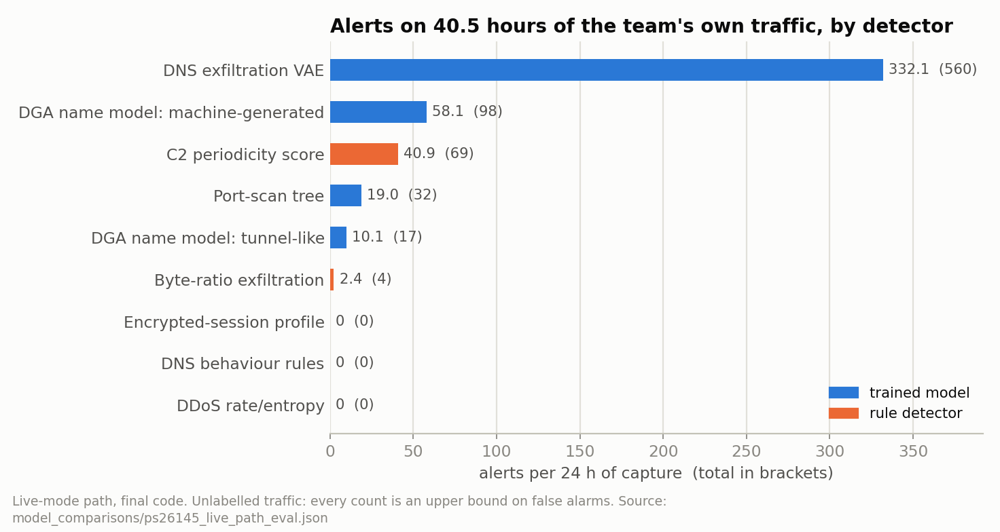
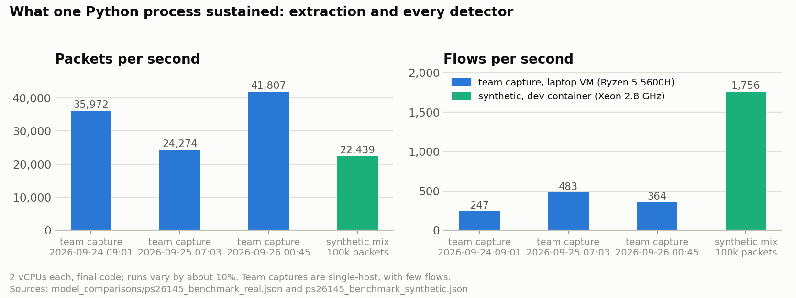
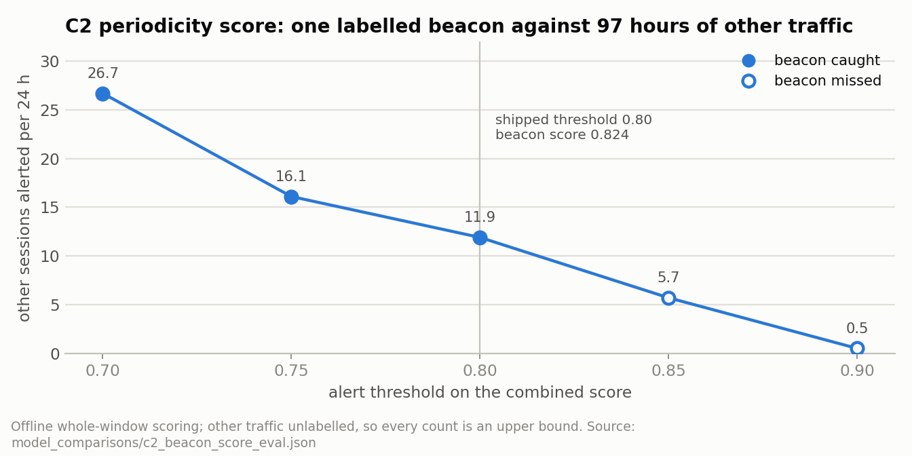
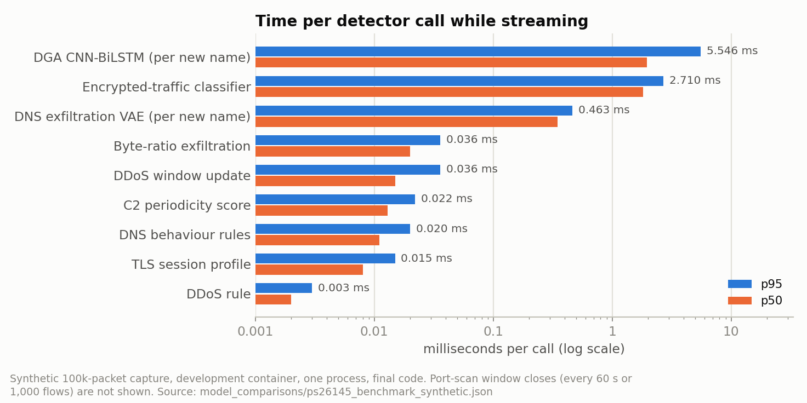
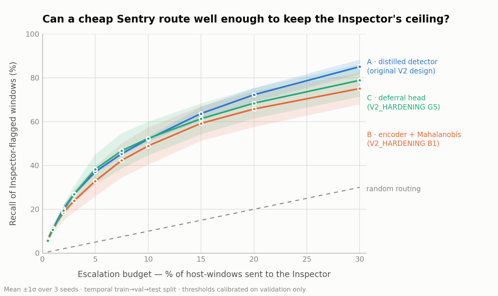
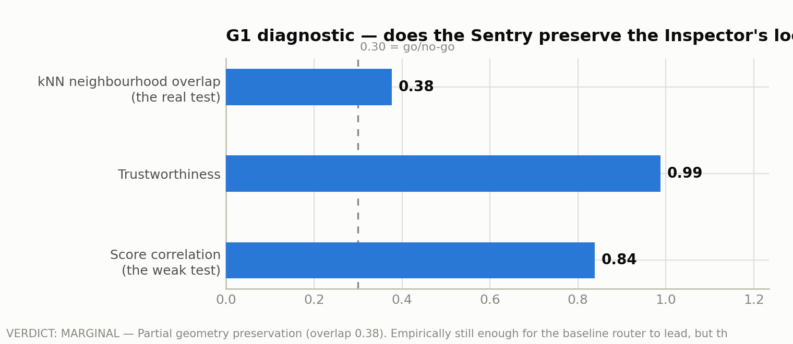
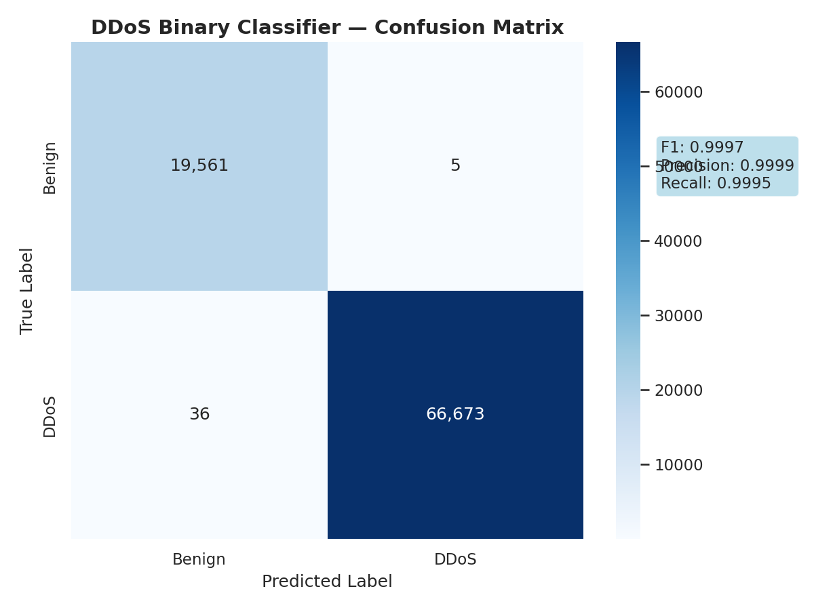
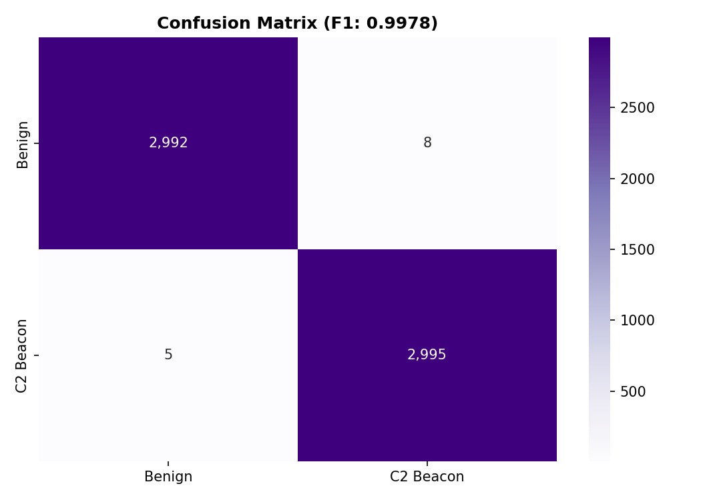
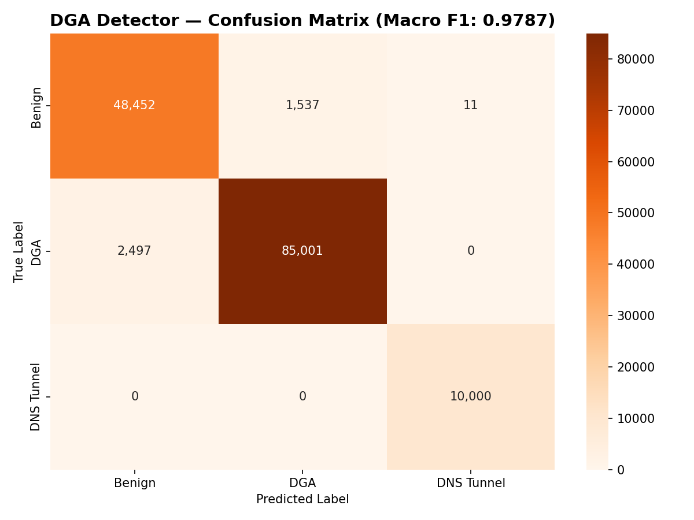

# NetSentinel

**A passive, agentless network intrusion detection system for unidirectional and
air-gapped networks.**

NetSentinel monitors network traffic it can only *watch* — never inject into,
never query back. It is built for environments where an endpoint agent cannot be
installed and where traffic crosses a data diode in one direction only: nuclear
and power facilities, defence networks, SCADA and industrial control systems,
and the IoT/BYOD segments of a normal enterprise where nothing can be installed
on the device.

It does not decrypt traffic, does not rely on signature feeds, and runs on CPU.

Built for Smart India Hackathon 2026, problem statement **26145 (NTRO)** —
see [PS 26145 at a glance](#ps-26145-at-a-glance) and the full mapping in
[`docs/PS26145_COMPLIANCE.md`](docs/PS26145_COMPLIANCE.md).

---

## The problem

Most detection assumes things a diode-protected or OT network cannot give you:

| Common assumption | Reality behind a data diode |
|---|---|
| An agent runs on the endpoint | Nothing can be installed on a PLC, HMI or vendor appliance |
| Traffic can be queried or replayed | The link is physically one-way |
| Payloads can be inspected | Traffic is TLS/QUIC encrypted end to end |
| Signatures identify the threat | Living-off-the-land abuse uses legitimate services |
| Alerts can be trusted later | An audit trail that can be edited proves nothing |

NetSentinel is built around those constraints rather than in spite of them.

---

## PS 26145 at a glance

Problem statement 26145 (NTRO): *AI-based detection of cyber threats in
unidirectional IP traffic*. For every item below,
[`docs/PS26145_COMPLIANCE.md`](docs/PS26145_COMPLIANCE.md) gives the code,
the evidence an alert carries, the parameters, the numbers with their source
files, and the stated limits. The console's
**Overview** tab shows the same mapping live, with alert counts per family,
throughput, latency and the constraints read from the running sensor.

| PS 26145 asks for | NetSentinel |
|---|---|
| (a) DDoS — SYN floods, UDP reflection/amplification, spoofed traffic; rate and source-IP entropy | XGBoost on CICFlowMeter flows, plus a per-destination 10 s rate/entropy window that names the family (SYN flood, reflection with the amplifier service, UDP/TCP flood, spoofed sources likely) and alerts on its own in live mode |
| (b) C2 beaconing | Combined periodicity score (timing, FFT, size, rarity, persistence) run live; the BiLSTM+FFT verdict is attached as evidence |
| (c) DGA / DNS tunnelling — entropy, n-grams, query length, record-type anomalies | Character-level CNN-BiLSTM, plus NXDOMAIN-burst, record-type-mix and subdomain fan-out rules; every query type is kept |
| (d) Malware in encrypted sessions — JA3/JA3S/JA4, packet-size and timing sequences | JA3/JA3S/JA4 from the cleartext hello, first-20-packet size/timing sequence, a TLS session profile score, optional operator blocklist (ships empty) |
| (e) Reconnaissance / port scans — fan-out across ports or hosts | SPSD decision tree, plus vertical fan-out and host-sweep backstops; unanswered probes are kept as flows |
| (f) Exfiltration — asymmetric volume, out/in byte ratio | Out/in byte-ratio rule per internal → external pair, plus the DNS-exfiltration VAE |
| Read-only ingest | pcap/pcapng replay and receive-only live capture; nothing in the sensor transmits |
| No payload decryption | TLS metadata from the cleartext hellos only; QUIC Initial parsing is off by default |
| Streaming with bounded latency | Every event analysed on arrival; windows of 10 s to 6 h by definition; p50/p95/p99 latency per event type and detector measured live |
| Stated and demonstrated throughput | `scripts/benchmark_throughput.py` and **Run benchmark** in the console |
| Standardized alert schema | `netsentinel.alert/v1` — [`docs/ALERT_SCHEMA.md`](docs/ALERT_SCHEMA.md), [`docs/alert_schema_v1.json`](docs/alert_schema_v1.json) |
| Dashboard with severity and confidence | Operator console at `/console/`, served by the backend |

Detectors marked as rules have a priori thresholds. Except for the C2
score, whether they catch attacks has only been shown on synthetic
scenarios; their alert volume was measured on 40.5 hours of the team's own
traffic. The compliance document says what each one has and has not been
measured on.

---

## Architecture

Two tiers. The first classifies traffic as it arrives; the second reasons about
how a host's behaviour changes over days.

```
                    ┌──────────────────────────────────────────────┐
   network tap ───▶ │  CAPTURE            pcap / live interface     │
   (one-way)        └──────────────────────┬───────────────────────┘
                                           │
                    ┌──────────────────────▼───────────────────────┐
                    │  EXTRACTION                                   │
                    │  flow assembly · CIC / UNSW / DNS features    │
                    │  session windows · JA3/JA3S/JA4 · SNI · ALPN  │
                    └──────────────────────┬───────────────────────┘
                                           │
      ╔════════════════════════════════════▼═══════════════════════╗
      ║  TIER 1 — live detection (per flow / per window)            ║
      ║  ┌──────────┬──────────┬───────────┬──────────┬──────────┐  ║
      ║  │  DDoS    │   DGA    │ C2 beacon │ Encrypted│ Port scan│  ║
      ║  └──────────┴──────────┴───────────┴──────────┴──────────┘  ║
      ║        + exfiltration   (trained models + rule detectors)   ║
      ╚════════════════════════════════════┬═══════════════════════╝
                                           │
                    ┌──────────────────────▼───────────────────────┐
                    │  ANALYZER      routing · gating · thresholds  │
                    │  ALERT MANAGER schema v1 · MITRE · severity   │
                    └──────────────────────┬───────────────────────┘
                                           │
                    ┌──────────────────────▼───────────────────────┐
                    │  INTEGRITY     Merkle log · Ed25519 ledger    │
                    │                proof-carrying alerts          │
                    └──────────────────────┬───────────────────────┘
                                           │
                    ┌──────────────────────▼───────────────────────┐
                    │  REST /api · WebSocket /ws · console · React  │
                    └──────────────────────────────────────────────┘

      ╔═════════════════════════════════════════════════════════════╗
      ║  TIER 2 — behavioural analysis  (tier2/)                     ║
      ║  Inspector (central, graph+attention) ──▶ Sentry (edge, GRU) ║
      ║  per-host baselining · cohort comparison · escalation budget ║
      ║  Telegram-C2 / living-off-trusted-services analysis          ║
      ╚═════════════════════════════════════════════════════════════╝
```

---

## Tier 1 — live detection

A streaming pipeline: packets become flows, DNS events and TLS handshakes;
each event is scored by specialised models and rule detectors as it arrives,
and surviving detections become alerts in one schema.

**Detection modules**

| Module | Looks for | Decided by |
|---|---|---|
| DDoS | SYN floods, UDP reflection/amplification, spoofed sources | XGBoost (pcap mode) and the rate/entropy rule (`detectors/ddos_volume.py`) |
| DGA / DNS tunnelling | Generated names; tunnels by name shape, record-type mix, NXDOMAIN bursts, subdomain fan-out | CNN-BiLSTM and the DNS behaviour rules (`detectors/dns_behaviour.py`) |
| C2 beacon | Machine-regular check-in rhythms, including jittered ones | Combined periodicity score (`detectors/beacon_score.py`); BiLSTM+FFT as evidence |
| Encrypted sessions | Rare JA3/JA4 clients with regular sessions and repeated packet-size shapes | TLS session profile (`detectors/tls_sessions.py`) |
| Port scan | Vertical scans, host sweeps, slow scans | SPSD decision tree with fan-out and sweep backstops |
| Exfiltration | Asymmetric uploads; data encoded in DNS names | Byte-ratio rule (`detectors/exfil_ratio.py`) and the VAE |

An encrypted-traffic application classifier (FT-Transformer, 14 classes)
runs as telemetry and does not raise alerts.

**Supporting stages**

- **Extraction** — flow assembly with idle/active timeouts and TCP teardown
  handling, CIC-style and ISCX-style feature sets, single-packet probe
  records, DNS queries of every type and their replies, session windows for
  sequence models, sizes and times of each flow's first 20 payload packets, and
  JA3/JA3S/JA4, SNI and ALPN from cleartext TLS hellos. QUIC Initial parsing
  exists but is off by default. Capture files are read by a struct-level
  pcap/pcapng reader that produces the same events as Scapy.
- **Analyzer** — routes events to the right modules and applies gating so a
  detector only fires when its preconditions hold.
- **Alert manager** — schema v1 (`netsentinel.alert/v1`), MITRE ATT&CK
  mapping, severity assignment, deduplication; every alert is checked against
  the schema as it is built.
- **Metrics** — packets, flows, events and alerts per second over 10 s
  windows, p50/p95/p99 latency per event type and per detector.
- **API layer** — REST under `/api` (health, alerts, stats, models,
  detectors, metrics, alert schema, PS 26145 status, benchmark, extractor
  stats, integrity verification) and a `/ws` WebSocket for live streaming.
- **Console** — `console/`, served at `/console/`, plain HTML/JS with no
  build step: PS 26145 overview, live alert table with the full alert record
  and evidence, hosts, models and rule parameters, integrity checks, capture
  replay, live capture, simulator and benchmark.
- **Dashboard** — the earlier React + Vite UI in `frontend/` still reads the
  legacy alert fields. Alerts no longer carry the made-up geolocation it
  drew on its globe, so those arcs are gone.

---

## Tier 2 — behavioural analysis (`tier2/`)

Tier 1 answers *"is this flow malicious?"*. Tier 2 answers a harder question:
*"has this host started behaving unlike itself, and unlike its peers?"* — the
case where an attacker uses only legitimate services and never trips a
per-flow detector.

**Inspector–Sentry cascade.** A central **Inspector** learns what normal looks
like for each host, using the host's own history plus a cohort of comparable
hosts. A small **Sentry** runs at the edge, scores continuously and cheaply, and
escalates only the most suspicious host-days to the Inspector within a fixed
budget. The split is not arbitrary: the Sentry is causal and can answer during
the day, while the Inspector reads a whole day at once and answers after it.

**Cross-service behaviour.** Traffic is resolved into service *categories*
(code repositories, messaging APIs, cloud storage, telemetry, and so on) and the
model reasons over the combination and shape of a host's category usage rather
than any single destination.

**Living-off-trusted-services analysis.** A dedicated track studies command and
control hidden inside services a host legitimately uses — for example a
Telegram Bot API channel on a machine whose owner really does use Telegram.
Where per-window classification is not possible even in principle, the analysis
produces a **bound** instead: it relates the bandwidth an implant can use to the
time it can remain unnoticed, so the limit is stated rather than assumed.

**Operational machinery.** Per-host score normalisation, a commissioning and
promotion state machine, a visibility gate that refuses to score when the sensor
view degrades, and guarded threshold recalibration.

Tier 2 currently runs as its own verified analysis track alongside the live
pipeline rather than inside it; wiring its detectors into the Tier 1 analyzer is
the next integration step.

**See it in the console.** The **Inspector–Sentry** tab re-derives Tier 2's
headline numbers from `tier2/*.json` each time it loads (each checked against
its documented value, real-data and synthetic results labelled apart), shows
its charts, and has a **Run the cascade** button that runs
`tier2/demo_scenario.py` — commissioning, distillation, steady state and
escalation on a synthetic organisation, about 30 seconds on CPU — streaming
its output live. That button needs PyTorch in the Python that runs it:
`NETSENTINEL_TIER2_PYTHON` if set, else a `tier2/.venv`, else
`../netsentinel-main/v2/.venv` (where the track was developed), else the
sensor's own Python.

---

## Integrity — alerts you can still trust later

A detection is only useful if it can be proved later that it was not altered.
NetSentinel maintains a tamper-evident transparency log:

- **Merkle transparency log (RFC 6962)** — every alert is a leaf; any alert can
  be proved to be in the log with an inclusion proof.
- **Append-only guarantee** — consistency proofs show the log grew by appending
  and was never rewritten.
- **Signed ledger** — alerts are batched into blocks, hash-chained, and signed
  with Ed25519; signed tree heads act as checkpoints.
- **Proof-carrying alerts** — an alert can travel with the evidence needed to
  verify it, and can be verified by a relying party without access to the
  ledger itself.
- **Replay** — recorded decisions can be re-derived and checked. Every
  detector issues a receipt: model-backed detectors commit the model file's
  digest and the input, rule detectors commit a digest of their parameters
  and the exact inputs of the decision, and replay recomputes it.

---

## Repository layout

```
netsentinel/              Tier 1 backend
  extractor/              flow assembly, CIC/ISCX/DNS features, pcap reader,
                          TLS hello parsing (JA3/JA3S/JA4), QUIC Initial parsing
  models/                 model-backed detectors + model registry
  detectors/              rule detectors: DDoS rate/entropy, C2 periodicity score,
                          DNS behaviour, TLS sessions, byte-ratio exfiltration
  pipeline/               analyzer, alert manager + schema v1, metrics, PS 26145 status
  integrity/              Merkle log, Ed25519 ledger, receipts, replay
  api/                    REST routes and WebSocket hub
  intel/                  operator TLS fingerprint blocklist (ships empty)
  netinfo/                network topology / subnet awareness
  simulator/              synthetic traffic generator (one scenario per PS family)
  bench.py                throughput benchmark
  main.py  config.py      app wiring and model resolution

console/                  operator console, served at /console/ (no build step)

tier2/                    Tier 2 behavioural analysis track
  netsentinel_v2/         Inspector-Sentry, cohort, calibration, loaders, QUIC
  telegram_c2.py          living-off-trusted-services analysis
  bench_evasion.py        evasion-ladder benchmark
  verify_all.py           one-command verification of the whole track
  HOW_THIS_FITS.md        how Tier 2 relates to Tier 1
  AUDIT.md                claim-by-claim evidence register
  INSPECTOR_SENTRY_SPEC.md  full Tier 2 specification

frontend/                 React + Vite dashboard
tests/                    backend test suite (conftest.py wires sys.path + --pcap)
scripts/                  training, diagnostics, dataset tooling
  evaluate_detection.py   per-class detection + false-positive harness
  benchmark_throughput.py throughput benchmark (synthetic or a real capture)
models/                   the 6 ONNX experts (vendored, no network needed)
docs/                     architecture, critique, guides, history
  PS26145_COMPLIANCE.md   problem statement → code, evidence, numbers, limits
  ALERT_SCHEMA.md         alert schema v1 (+ alert_schema_v1.json)
tools/                    verification utilities
integrity/                ledger state and signed tree heads

PIPELINE_TEST_20SEP.md    first full-pipeline run: throughput, integrity
PIPELINE_TEST_PART2.md    alert-volume and exfiltration findings + fixes
PIPELINE_TEST_PART3.md    what is and is not claimable  <- read this one
```

---

## Getting started

**Prerequisites** — Python 3.11, Node.js 18+, and libpcap (Linux) or Npcap
(Windows) for live capture.

### 1. Backend

```bash
pip install -r requirements.txt
python run.py                      # serves on http://localhost:8000
```

Open the console at **http://localhost:8000/console/**.

The six ONNX models ship in `models/` and load in about 1.5 seconds with **no
network access at all** — which is the point, for an air-gapped deployment.
`get_model_path()` resolves in this order:

1. `$NETSENTINEL_MODELS_DIR`
2. `<repo>/models/` ← the vendored copy, used by default
3. `~/.cache/netsentinel/models/`
4. Hugging Face (`Unded-17/netsentinel-models`), only if nothing local matched

A missing model is a hard startup failure, not a warning — a security product
that silently runs without its detectors is worse than one that refuses to start.

### 2. Dashboard

The operator console needs nothing beyond the backend (see above). The
earlier React dashboard is still available:

```bash
cd frontend
npm install
npm run dev
```

### 3. Tier 2

```bash
cd tier2
pip install -r requirements.txt
python verify_all.py               # runs every suite and re-derives every figure
```

### 4. Feeding it traffic

Point the backend at a capture file or a live interface (console → Ingest),
or use the built-in traffic simulator under `netsentinel/simulator/`, which
has one synthetic scenario per PS 26145 threat family, to drive the console
without a live tap.

Throughput benchmark (replays through extraction and every detector as fast
as one process can):

```bash
python scripts/benchmark_throughput.py --synthetic 100000
python scripts/benchmark_throughput.py --pcap path/to/capture.pcap --json result.json
```

QUIC Initial parsing (reads the ClientHello inside QUIC Initial packets, whose
keys are public — RFC 9001 §5.2) is off by default; set
`NETSENTINEL_QUIC_INITIAL_PARSE=1` to enable it.

---

## Status and verification

Every figure here is dated and reproducible with the commands above. Nothing
in this section is an estimate. The 20 September rows describe the pipeline
before the PS 26145 update (27 September) and are kept as a record.

| | measured | date |
|---|---|---|
| Test suite (`pytest tests/`) | **100 passed, 11 skipped, 0 errors** (8 skips look for model files under an old path, 3 need capture fixtures) | 27 Sep |
| PS 26145 tests (`tests/test_ps26145.py`, `tests/test_tls_fingerprints.py`) | 27 + 11 pass: schema v1 on every detector, all six families fire in simulation, the six fixes found on real traffic, JA3/JA4/Community ID/RFC 9001 reference values, fast reader = Scapy | 27 Sep |
| Throughput, team captures (Linux VM on the team's laptop, one process, 2 vCPUs Ryzen 5 5600H; `model_comparisons/ps26145_benchmark_real.json`) | three 200 MB files: **24,274–41,807 packets/s**, 247–483 flows/s, 163–654× real time; flow event p95 1.9–2.5 ms; runs vary by about 10% | 27 Sep |
| Throughput, synthetic capture (development container, one process, 2 vCPUs Xeon @ 2.80 GHz; `model_comparisons/ps26145_benchmark_synthetic.json`) | 100,006 packets: **22,439 packets/s, 124.1 Mbps, 1,756 flows/s**, 4.6× real time; flow event p50 0.09 ms, p95 0.19 ms | 27 Sep |
| Tier 2 headline numbers re-derived by the sensor (`GET /api/tier2`, from `tier2/*.json`) | 16 of 16 match their documented values (LANL real data: 0.992 agreement, 96.9% of Inspector flags at a 5% budget, within-host AUC 0.557 ± 0.013) | 27 Sep |
| Live-mode path on 40.5 h of the team's traffic (`model_comparisons/ps26145_live_path_eval.json`) | 780 alerts (462.5 per 24 h, upper bound: unlabelled): DNS-exfiltration VAE 560, DGA model 115, C2 score 69, port scan 32, byte ratio 4; DDoS rule, DNS rules and TLS-session rule 0 | 27 Sep |
| Integrity: inclusion, append-only, signed ledger | **42 / 42** | 20 Sep |
| Tier-2 Telegram-C2 bound | **17 / 17** | 20 Sep |
| Models | 6 / 6 load in ~1.5 s, no network | 20 Sep |
| Real 200 MB single-host capture | 2,113 flow events → **34 alerts (1.61%)**, 4 actionable (IPv4 part only: the extractor had no IPv6 handling then — `PIPELINE_TEST_PART4.md`) | 20 Sep |
| Throughput | ~49× real time, single core, 244 MB RSS | 20 Sep |
| Analyzer errors on real traffic | **0** | 20 Sep |

### What we do not claim

This is the part most projects skip, so it is stated plainly:

> **We do not claim an accuracy, a recall figure, or a false-positive rate.**
> Those require labelled data, and our capture has none. Everything measured
> above is *behaviour*, not accuracy.

Concretely:

- **Per-class recall numbers from `scripts/evaluate_detection.py` are circular.**
  The attack traffic comes from our own simulator, written by the same people as
  the detectors. That measures "does it fire on what we built it to fire on",
  not "does it catch real attacks". It is a wiring smoke test and an upper
  bound — the harness prints that warning next to its own output by design.
- **The 34 real-capture alerts are an upper bound on false positives**, not a
  false-positive rate. The capture has no ground truth, so we cannot verify it
  contains no intrusion.
- **Port scan's 99.0%** (17,843 of 18,023 scans, as counted in
  `PORT_SCAN_COMPLETE.md`, which prints 99.03%; the counts give 99.0%) is the
  SPSD model on a CIDDS-001 *validation set*. It is not a NetSentinel
  detection rate.
- **The rule detectors** (DDoS rate/entropy, DNS behaviour, TLS sessions,
  byte-ratio exfiltration) have a priori thresholds; whether they catch
  attacks has only been shown on synthetic scenarios. On 40.5 hours of the
  team's own traffic they raised 0, 0, 0 and 4 alerts — a measure of noise,
  not of detection. The C2 periodicity score is the one rule with a labelled
  real case: on 97 captured hours with one labelled beacon it caught the
  beacon at 0.80 and raised 11.9 other alerts per 24 h of capture scored
  offline, and 40.9 per 24 h live on the 40.5 hours (upper bounds, since the
  rest of the traffic is unlabelled).
- **Simulator alerts** show that the code paths work, not how well real
  attacks are caught; the simulator is synthetic and labelled as such
  everywhere it appears.
- A publishable recall figure needs labelled real intrusion captures
  (CIC-IDS2017, CTU-13, UNSW-NB15). That work has not been done.

`PIPELINE_TEST_PART3.md` carries the full argument, the open defects, and a
correction to an earlier root-cause diagnosis of our own that turned out to be
wrong.

### Known open items

- **C2: the BiLSTM no longer decides.** On the real beacon's window it gave
  every pair it could score a probability of about 1.0 and, with its gates,
  missed the beacon and flagged a benign pair
  (`model_comparisons/c2_compare.json`). The combined periodicity score now
  decides; the BiLSTM verdict is evidence (`C2_BILSTM_ALERTS = False`).
- **Live-mode DDoS is the rate/entropy rule.** The XGBoost model reads
  CICFlowMeter features, which only exist when replaying a capture.
- **ICMP is not parsed** by the flow extractor, so ping sweeps are not seen.
- **`netsentinel/netinfo/network_info.json` is a demo topology**; the SPSD
  port-scan model needs the real site's subnets and hosts.
- **QUIC Initial parsing is off by default**, so QUIC flows are analysed on
  sizes and timing only unless it is enabled.
- **The DNS models are the noisiest part on real traffic**: on 40.5 hours of
  the team's traffic the exfiltration VAE raised 560 alerts (332 per 24 h,
  mostly INFO) and the DGA model 115, even with one alert per source and
  base domain per 10 minutes.
- **The port-scan tree needs the site described.** Its main rules are
  contacts to internal addresses, or ports, that
  `netsentinel/netinfo/network_info.json` does not list. The shipped file
  describes a demo network, and all 32 port-scan alerts on the team's 40.5
  hours came from that. Describe the site there, or empty `known_hosts` and
  `known_open_ports` to switch those two indicators off.
- **The scikit-learn pin is not enforced** (1.3.2 pinned, 1.7.2 running). This
  skew has already produced two real defects; one silently corrupted a model's
  output while every test stayed green.
- Tier 2 runs as its own verified track; wiring it into the Tier-1 analyzer is
  the next integration step.

---

## Figures

### PS 26145 evidence

Drawn by `scripts/make_ps_figures.py` from the result files named under each
chart; nothing is typed in by hand. The console shows the same figures on the
Models tab.



*Alert volume of the live-mode path on the team's own traffic. The traffic is
unlabelled, so these are upper bounds on false alarms. The three rule
detectors that raised nothing have been shown to fire only on synthetic
attacks (`model_comparisons/ps26145_live_path_eval.json`).*



*Constraint (d): one process through extraction and every detector
(`model_comparisons/ps26145_benchmark_real.json`, `ps26145_benchmark_synthetic.json`).*



*Why the C2 score's threshold is 0.80: the last setting that still catches the
one labelled beacon (`model_comparisons/c2_beacon_score_eval.json`).*



*Constraint (c): time per detector call while streaming
(`model_comparisons/ps26145_benchmark_synthetic.json`).*

### Tier 2 — Inspector–Sentry

<table>
<tr>
<td width="50%"><br><sub>Recall of Inspector-flagged windows against the escalation budget, three routers, mean ± 1 sd over 3 seeds (synthetic).</sub></td>
<td width="50%"><br><sub>Does the Sentry keep the Inspector's local geometry? kNN overlap 0.38: marginal.</sub></td>
</tr>
</table>

### Tier 1 models, on their own test splits

These are the models' results on held-out parts of their training data, not
detection rates on a NetSentinel deployment.

<table>
<tr>
<td width="50%"><br><sub>DDoS XGBoost, binary — CIC-DDoS2019 test split.</sub></td>
<td width="50%"><br><sub>DDoS XGBoost — SHAP summary of the features it leans on.</sub></td>
</tr>
<tr>
<td><br><sub>C2 BiLSTM+FFT — its own test split. On real traffic it could not rank a real beacon (section 3(b) of the compliance document), so it is evidence, not the decision.</sub></td>
<td><br><sub>C2 BiLSTM+FFT — training curves.</sub></td>
</tr>
<tr>
<td><br><sub>DGA CNN-BiLSTM — benign / DGA / tunnel. The tunnel class was generated synthetically in training.</sub></td>
<td><br><sub>Encrypted-traffic FT-Transformer — 14 ISCX VPN-nonVPN classes (telemetry, no alerts).</sub></td>
</tr>
<tr>
<td><br><sub>DDoS, 18 classes — macro F1 0.55, so its label is only a hint on DDoS alerts.</sub></td>
<td><br><sub>Port scan — the legacy per-flow XGBoost on CIC-IDS2017, kept as a score; the SPSD tree decides.</sub></td>
</tr>
</table>

---

## Design decisions

**Detection only.** NetSentinel observes and reports. It does not block, reset
connections or modify traffic — on a one-way link it could not, and in an OT
environment an automated block is itself a safety risk.

**No decryption.** TLS is read only as far as the cleartext handshake: JA3,
JA3S, JA4, service name and ALPN, never contents. QUIC carries its handshake
inside Initial packets protected with keys derived from public values
(RFC 9001 §5.2); reading those is off by default and, when enabled, touches
only a flow's first client Initial packets. Detection works on behaviour —
volume, rhythm, direction, which services a host touches and in what
combination.

**CPU only.** No GPU is required anywhere in the live path.

**Complementary to EDR, not a replacement.** NetSentinel covers what an agent
cannot reach. Where endpoint telemetry exists, it remains the better source.

**Per-deployment calibration.** What counts as normal is a property of the
network being watched. Tier 2 establishes its thresholds during a
commissioning window on site; the Tier 1 rule thresholds ship as documented
starting points in `netsentinel/config.py` and are meant to be tuned per site.

---

## Prior art and attribution

This project builds on published work and says so:

- The Tier 2 Inspector follows the **GraphIDS** architecture
  (arXiv:2509.16625). It is prior art, not our design.
- The **teacher–student cascade**, **knowledge distillation** and **per-entity
  baselining** are all established techniques.
- The transparency log follows **RFC 6962 (Certificate Transparency)**.
- TLS/QUIC handling follows **RFC 9000 / RFC 9001**. JA3/JA3S follow the
  **Salesforce** specification, JA4 the **FoxIO** specification (the JA4 TLS
  client fingerprint is BSD-3-Clause), and flow IDs use **Community ID v1**
  (Corelight).
- The port-scan model follows the **SPSD** network-event method of
  **Ring et al. (2018)**, trained on CIDDS-001.
- Feature definitions draw on the **CICFlowMeter** and **UNSW-NB15** feature sets.

What we claim as our own contribution is narrower: the cross-service category
semantics used to reason about living-off-trusted-services behaviour, the
chained-behaviour dataset built to test it, and the bound relating an implant's
bandwidth to the time it can stay unnoticed.

---

## License

See `LICENSE`.
